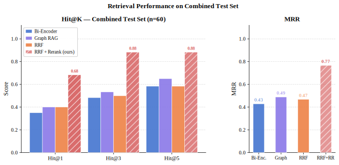
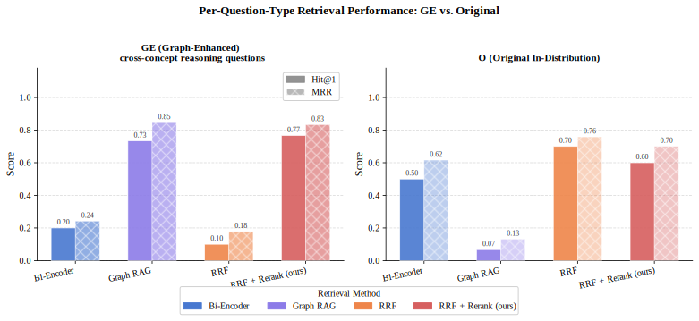
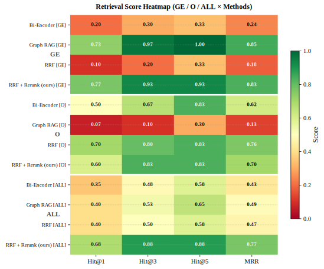

# Interview Me

An AI-powered mock interview system with multi-agent orchestration and dual-pipeline RAG retrieval.

> Feed it your knowledge base. It interviews you back.


---

## Demo

> _Screenshot / GIF placeholder — coming soon_

---

## Key Features

- **Multi-agent state machine** — Director, Interviewer, and Scorer agents collaborate across a structured interview flow with dynamic branching (`pass` / `continue` / `deep_dive`)
- **Dual RAG pipeline** — Vector similarity search and Graph RAG run in parallel; results are fused via Reciprocal Rank Fusion (RRF), path scoring, and cross-encoder reranking
- **Forked conversation tree** — Branch the interview at any point to explore alternative question paths; each branch is independently navigable
- **ReAct tool use** — Interviewer agent retrieves knowledge, profile, and session history via tool calls before generating each question
- **LLM-agnostic** — Runs on Anthropic, OpenAI, or any OpenAI-compatible endpoint (DeepSeek, Ollama, etc.)
- **Local-first** — ChromaDB vector store and graph index persist on disk; no external services required

---

## Architecture

### Multi-Agent System

Three specialized agents coordinate through a finite state machine:

- **Director** — decomposes the interview topic into a task list, advances the session based on Scorer verdicts, and decides when the interview ends
- **Interviewer** — generates questions using a ReAct loop (Thought → Tool Call → Observation) with access to the knowledge base, user profile, and past sessions
- **Scorer** — evaluates each answer and emits a verdict (`pass` / `continue` / `deep_dive`) that drives the next state transition

The **Thought Tree** records every task and question as nodes, making the interview structure inspectable and replayable.



<!-- TODO: replace with exported multi-agent drawio PNG -->

### Dual RAG Pipeline

Retrieval runs two independent paths in parallel and merges results through three post-processing steps:

| Stage | Vector Path | Graph Path |
|---|---|---|
| **Retrieval** | Vector similarity search (ChromaDB, BGE embedding) | Entity + relation vector search over knowledge graph |
| **Expansion** | — | BFS 1-hop expansion → collect source chunk IDs |
| **Post-processing** | ↘ RRF Fusion → Path Scoring → Cross-Encoder Rerank ↙ | |

The knowledge graph is built offline: each Markdown chunk is passed through an LLM to extract entities and relations as triples, which are embedded and stored alongside the vector index.

<!-- TODO: replace with exported dual-rag drawio PNG -->

### Fork Conversation Tree

At any point in the interview, the user can fork the conversation — creating a new branch from the current node. Each branch maintains its own independent question history, letting you explore "what if I had answered differently" or compare two question directions from the same starting point.

<!-- TODO: replace with exported fork-tree drawio PNG -->

> Architecture diagrams are generated from [`docs/diagrams/gen_arch.py`](docs/diagrams/gen_arch.py) and can be opened in [diagrams.net](https://app.diagrams.net).

---

## RAG Evaluation

We evaluated four retrieval strategies on two test sets:

- **O** (Original, n=30) — in-distribution questions drawn directly from the knowledge base
- **GE** (Graph-Enhanced, n=30) — cross-concept questions requiring multi-hop reasoning across knowledge chunks

### Results

**Overall (n=60)**


**Per question type**



**Full breakdown**



| Method | Hit@1 | Hit@3 | Hit@5 | MRR |
|---|---|---|---|---|
| Bi-Encoder | 0.35 | 0.48 | 0.58 | 0.43 |
| Graph RAG | 0.40 | 0.53 | 0.65 | 0.49 |
| RRF | 0.40 | 0.50 | 0.58 | 0.47 |
| **RRF + Rerank (ours)** | **0.68** | **0.88** | **0.88** | **0.77** |

Key observations:
- Graph RAG alone excels on GE questions (Hit@1 = 0.73) but degrades sharply on in-distribution questions (Hit@1 = 0.07), where vector search dominates
- Fusing both paths with RRF + path scoring + reranking achieves the best results across both question types — a +0.33 Hit@1 gain over the next-best single method

> Evaluation scripts: [`experiments/rag/`](experiments/rag/)

---

## Getting Started

### Prerequisites

- Python 3.11, Node.js 18+
- [conda](https://docs.conda.io/en/latest/miniconda.html)
- An LLM API key (Anthropic, OpenAI, or compatible)

### Installation

```bash
# 1. Clone
git clone https://github.com/yourname/interview-me.git
cd interview-me

# 2. Backend environment
conda create -n interview-me python=3.11 -y
conda activate interview-me
pip install -r backend/requirements.txt

# 3. Frontend
cd frontend && npm install && cd ..

# 4. Configure LLM
cp backend/.env.example backend/.env
# Edit backend/.env — set LLM_PROVIDER, LLM_API_KEY, LLM_MODEL
```

### Run

```bash
./start.sh
```

- Frontend: http://localhost:3000
- Backend API: http://localhost:8000
- API docs: http://localhost:8000/docs

### LLM Providers

```bash
# Anthropic (default)
LLM_PROVIDER=anthropic LLM_API_KEY=sk-ant-xxx

# OpenAI
LLM_PROVIDER=openai LLM_API_KEY=sk-xxx

# DeepSeek
LLM_PROVIDER=openai-compatible LLM_API_KEY=xxx \
  LLM_BASE_URL=https://api.deepseek.com/v1 LLM_MODEL=deepseek-chat

# Ollama (local, no key needed)
LLM_PROVIDER=openai-compatible \
  LLM_BASE_URL=http://localhost:11434/v1 LLM_MODEL=llama3
```

---

## Project Structure

```
interview-me/
├── backend/
│   ├── main.py              # FastAPI app, LLM provider abstraction
│   ├── interview_agent.py   # Multi-agent state machine + ReAct loop
│   ├── rag.py               # Vector RAG (ChromaDB, BGE, reranker)
│   ├── graph_rag.py         # Graph RAG (entity extraction, BFS)
│   ├── tools/               # Tool registry (knowledge, profile, sessions)
│   ├── knowledge/           # Markdown knowledge base files
│   └── sessions/            # Persisted conversation trees (JSON)
├── frontend/
│   └── src/
│       ├── pages/           # Interview, KnowledgeQA, Review pages
│       └── components/      # Chat, panels, tiles
├── experiments/
│   └── rag/                 # Eval scripts, test sets, logs
├── docs/
│   └── diagrams/            # Architecture diagram scripts + outputs
└── start.sh                 # One-command startup
```

---

## License

MIT
